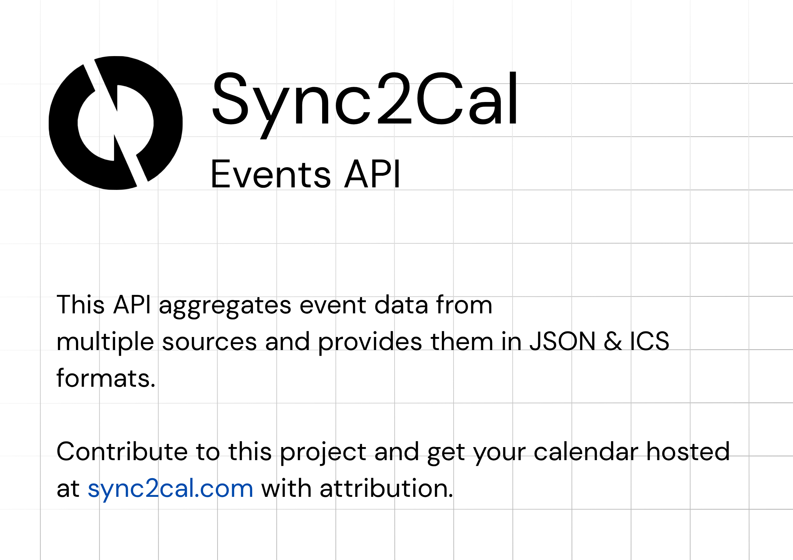

[](LICENSE)


Sync2Cal Events API turns information from popular websites into calendar events that you can subscribe to. You get simple web links (ICS feeds) that work with Google Calendar, Apple Calendar, Outlook, and others. Each “integration” knows how to read one source (like Twitch, IMDb, etc.) and present upcoming items as calendar events.

### Table of Contents
- [Setup](#setup)
- [Credentials](#credentials)
- [Creating Your Own Integration (Contributing Guide)](#creating-your-own-integration-inherit-the-base-class)
- [Mounting in main.py](#mounting-in-mainpy)
- [API Endpoints](#api-endpoints)
- [Existing Integrations and Credentials](#integrations-and-credentials)

## Setup
1) Install Python 3.10+ and create a virtual environment.
2) Install dependencies: `pip install -r requirements.txt`.
3) Copy `env.template` to `.env` and fill in any credentials you have.
4) Run the server: `uvicorn main:app --reload --env-file .env` and open `http://localhost:8000/docs`.

### Credentials
- Keep your `.env` file private; it is already ignored by git.
- Some integrations need credentials. Others work anonymously.

## Creating Your Own Integration (inherit the base class)
Each integration is a small class that inherits a common base and returns a list of events. Keep parameters explicit (no `*args/**kwargs`).

```python
from typing import List
from datetime import datetime, timedelta
from fastapi import HTTPException
from base import CalendarBase, Event, IntegrationBase


class MyCalendar(CalendarBase):
    def fetch_events(self, query: str, limit: int = 10) -> List[Event]:
        try:
            # Logic to fetch events from a soruce via scraping or API.
            return events
        except Exception as e:
            raise HTTPException(status_code=500, detail=str(e))


class MyIntegration(IntegrationBase):
    def fetch_calendars(self, *args, **kwargs):
        # Append all calendars to self.calendar
        return None
```

That’s it. Mount it in `main.py` with a small router, and it will appear in `/docs` with a single `/events` endpoint.

```python
# main.py
from fastapi import FastAPI, APIRouter
from base import mount_integration_routes
from integrations.my_integration import MyIntegration, MyCalendar

app = FastAPI(title="MyIntegration")

my_router = APIRouter(prefix="/mysource", tags=["MySource"])
my_integration = MyIntegration(
    id="mysource",
    name="MySource",
    description="My custom integration",
    base_url="https://api.example.com",
    calendar_class=MyCalendar,
    multi_calendar=False,
)

mount_integration_routes(my_router, my_integration)
app.include_router(my_router)
```

## Integrations and Credentials
- Twitch: requires `TWITCH_CLIENT_ID`, `TWITCH_CLIENT_SECRET`
- Google Sheets: optional `GOOGLE_SHEETS_SERVICE_ACCOUNT_FILE` (path to the service account JSON; default `service_account.json`)
- TheTVDB: requires `THE_TVDB_API_KEY`, `THE_TVDB_BEARER_TOKEN`
- IMDb: no credentials
- Investing.com: no credentials
- TheMovieDB (website scrape): no credentials
- WWE: no credentials
- TV Shows (TVInsider): no credentials
- Releases.com: no credentials
- TheSportsDB (public endpoint): no credentials
  - Set `SPORTSDB_API_KEY` (your API key). Example requests in the app will use this key to build URLs like:
    `https://www.thesportsdb.com/api/v1/json/${SPORTSDB_API_KEY}/eventsnextleague.php?id=4328`.

Use `.env` to store any values you need. If you don’t use a particular integration, you can leave its values empty.


### Mounting in `main.py`
This repo’s `main.py` uses a clean loop to register integrations. Each integration is instantiated and mounted automatically based on its `id` and `name`.

```python
from fastapi import APIRouter
from base import mount_integration_routes

integrations = [
    # ... instances of IntegrationBase subclasses ...
]

for integration in integrations:
    prefix = f"/{integration.id.replace('_', '-')}"
    router = APIRouter(prefix=prefix, tags=[integration.name])
    mount_integration_routes(router, integration)
    app.include_router(router)
```

## API Endpoints
- See docs/ENDPOINTS.md for details on the `/events` route, the `ics` parameter, and example requests.


